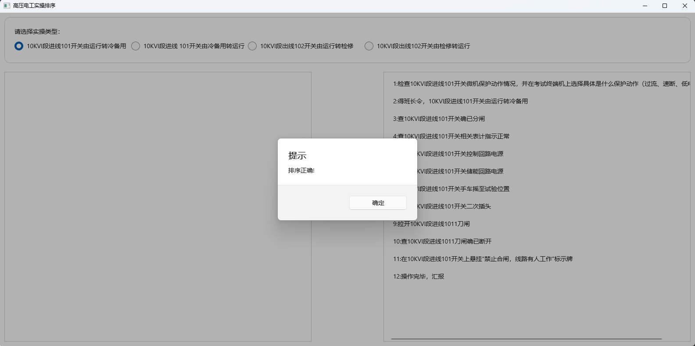

# 特种作业证书之高压电工实操考试排序练习程序
 

## 高压电工实操考试概述

高压电工实操考试考察4种工作票：
- 10KVI段进线101开关由运行转冷备用
- 10KVI段进线101开关由冷备用转运行
- 10KVI段出线102开关由运行转检修
- 10KVI段出线102开关由检修转运行

实操考试流程如下：
- 排序 30分
- 佩戴安全用具（安全帽，绝缘手套） 20分
- 操作 50分

考试时间共12分钟。

## 高压电工实操考试排序练习程序

本练习程序使用 .NET WINUI3开发，运行在Win App SDK 1.6上。

针对4种工作票，每次排序按随机打乱原始顺序，用户排序完成可点击按钮“排序结果”来检查结果。

- 源代码：在目录\SortingApp下
- 运行程序：\Build\net8.0-windows10.0.26100.0\win-x64\SortingApp.exe

## 运行前提条件

程序运行的前提条件：
- 操作系统为Windows 10、Windows 11或新的Windows系统
- 安装有Win App运行时1.6
https://aka.ms/windowsappsdk/1.6/latest/windowsappruntimeinstall-x64.exe
从上面官方地址下载并安装Win App SDK 1.6。

## 如何运行

拷贝运行程序到本地。

1. 使用\Build\net8.0-windows10.0.26100.0\win-x64\SortingApp.exe启动程序，
应用打开界面如下图：

2. 从左侧列出的随机步骤中点击第一步，程序将选中的步骤挪到右侧列表中如下图：

3. 按正确的顺序依次点击左侧列表中的步骤，排序完成如下图：

4. 点击按钮”排序结果“检查排序是否正确，排序正确显示如下图：

5. 排序失败显示如下图：

6. 每次选择实操类型，程序会初始化并打乱顺序显示于左侧列表中。可以选择另外一种操作票，再选择当前操作票来重新练习。
 